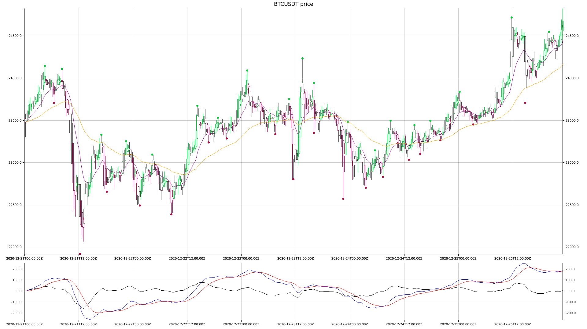

## WIP: Experimental bot trader for crypto currency written in Rust
It's a personal project and it's not finished.

### Objectives
* Synchronize candles from exchange into local database
* Provide fast back test with custom trade rules
* Allow custom trade from script file
* Automatize live trade operations
* Tooling to verify operations from plotted chart images

### Current state
- [x] Read candles from Binance API
- [x] Download and synchronize missing candles in local database
- [x] Convert traditional candles to Heikin-Ashi candles
- [x] Plot image with candles and indicators
- [x] Detect top/bottom candles
- [x] Allow run with input/output stream to interop with other process
- [x] MVP scripting custom rules (📢 NEW! 😎)
- [ ] Add more functions to technical analysis scripting
- [ ] Register position, operation, profits and others
- [ ] Visual tools for checking operations
- [ ] Bot trade runner
- [ ] GUI

### Generated sample chart


### Main libs used
* [Binance API](https://crates.io/crates/binance)
* [TA (Technical Analysis)](https://crates.io/crates/ta)
* [SQLx](https://crates.io/crates/sqlx)
* [Plotters](https://crates.io/crates/plotters)
* [rhai (Scripting Language)](https://crates.io/crates/rhai)

### Prerequisites

1) Rust 1.51 or greater

2) Environment variables (or .env file in current directory):
`API_KEY` Binance API key
`SECRET_KEY` Binance API secret
`DATABASE_URL` Postgres database URL

3) Dependencies (due plot library)
```
sudo apt install git curl autoconf libx11-dev libfreetype6-dev libgl1-mesa-dri \
    libglib2.0-dev xorg-dev gperf g++ build-essential cmake libssl-dev \
    liblzma-dev libxmu6 libxmu-dev \
    libxcb-render0-dev libxcb-shape0-dev libxcb-xfixes0-dev \
    libgles2-mesa-dev libegl1-mesa-dev libdbus-1-dev libharfbuzz-dev ccache \
    clang libunwind-dev libgstreamer1.0-dev libgstreamer-plugins-base1.0-dev \
    libgstreamer-plugins-bad1.0-dev autoconf2.13 llvm-dev
```

3) SQLx
```
cargo install sqlx-cli
```

### Setup
Steps to create Postgres database:
```
sqlx database create
sqlx migrate run
```

### Running
Example plot command, that generates image in `out/` directory:
```
cargo run --release -- --debug -y BTCUSDT -m 15 -s "2020-12-21 00:00:00" -e "2020-12-25 23:00:00" plot
```
Parameters:
-y symbol
-m minutes candle time
-s start date time
-e end date time

Example run backtest script:
```
cargo run --release -- -y BTCUSDT -m 15 -s "2020-11-01 00:00:00" -e "2020-12-31 23:45:00" script-back-test --file examples/mcad.rhai
```
Script content:
```rhai
fn buy() {
    if macd(15, 34, 72, 17) > macd_signal(15, 34, 72, 17) {
        true
    } else {
        false
    }
}
```

Other commands samples in `examples/command/` directory.
